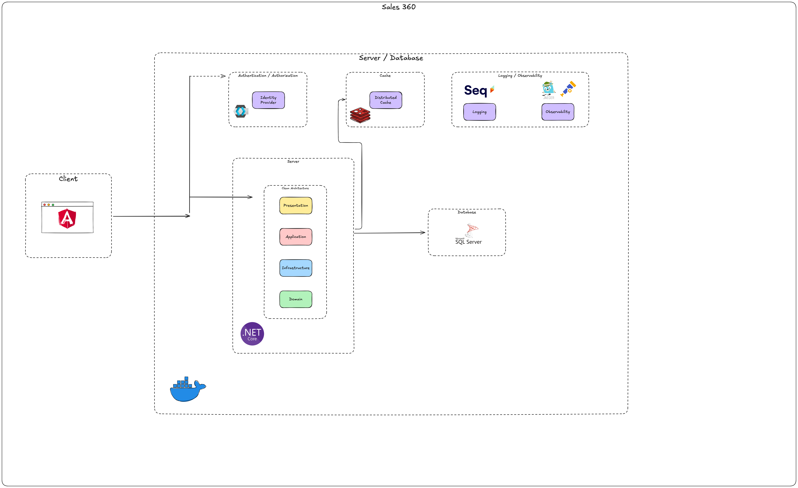
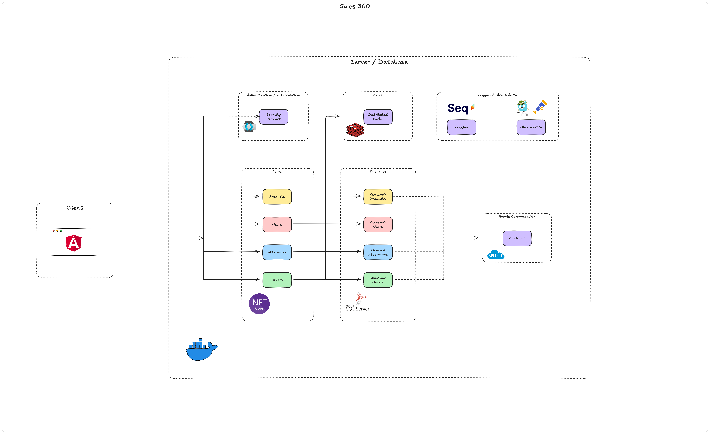

# Projeto de Migração: Monólito para Monólito Modular

## Visão Geral

Este projeto tem como objetivo realizar a migração de um sistema monolítico tradicional para uma arquitetura de **Monólito Modular (MOM)**. 
A refatoração busca melhorar a escalabilidade, modularidade e manutenibilidade do sistema através da aplicação de princípios como **Domain-Driven Design (DDD)**, **Command Query Responsibility Segregation (CQRS)** e **Arquitetura Limpa (AL)**.

## Arquitetura Escolhida: Comparativo e Justificativas

A migração foi motivada pela necessidade de superar limitações do sistema monolítico tradicional e aproveitar os benefícios de uma estrutura modular, sem abrir mão da simplicidade de deploy que um monólito oferece. A seguir, detalhamos cada arquitetura apresentada no diagrama, destacando as principais diferenças e as justificativas para a mudança.

### 1. Monolito Tradicional

- **Descrição:**  
  O sistema original é implementado como um monólito, onde todas as funcionalidades e módulos compartilham o mesmo processo e ambiente de execução.

- **Características e Desafios:**
   - **Acoplamento Forte:**  
     As funcionalidades estão intimamente ligadas, fazendo com que mudanças em um módulo possam impactar o sistema inteiro.
   - **Escalabilidade Limitada:**  
     O sistema só pode ser escalado como um todo, o que pode levar à utilização ineficiente de recursos.
   - **Manutenção Complexa:**  
     Alterações e correções podem se tornar arriscadas e demoradas devido à falta de separação clara entre os domínios.
   - **Deploy Unificado:**  
     Apesar de simplificar o deploy, o fato de todas as funcionalidades estarem no mesmo pacote dificulta a adoção de práticas de atualização contínua sem riscos.

- **Justificativa para a Mudança:**  
  A alta complexidade e os desafios de manutenção e escalabilidade evidenciaram a necessidade de uma separação melhor dos domínios do sistema, reduzindo o risco de impactos colaterais durante alterações.

### 2. Monólito Modular (MOM)

- **Descrição:**  
  A nova arquitetura mantém o sistema em um único processo, mas organiza o código em módulos bem definidos, cada um responsável por um domínio específico do negócio.

- **Benefícios:**
   - **Baixo Acoplamento:**  
     Os módulos são independentes e se comunicam por meio de interfaces e eventos, o que minimiza dependências diretas.
   - **Escalabilidade Seletiva:**  
     Permite escalar individualmente os módulos críticos sem precisar replicar o sistema inteiro.
   - **Manutenibilidade Melhorada:**  
     Alterações em um módulo podem ser realizadas com menor impacto nos demais, facilitando testes e atualizações.
   - **Organização e Coesão:**  
     Cada módulo agrupa funcionalidades relacionadas, tornando o sistema mais organizado e alinhado com os princípios do DDD.

- **Justificativa para a Mudança:**  
  Ao adotar o conceito de Monólito Modular, a equipe consegue manter a simplicidade do deploy e a consistência do ambiente monolítico, enquanto aproveita as vantagens da modularização para facilitar a manutenção, permitir escalabilidade seletiva e reduzir riscos durante mudanças.

### Comparativo Resumido

| Aspecto               | Monolito Tradicional                                | Monólito Modular (MOM)                          |
| --------------------- | --------------------------------------------------- | ------------------------------------------------ |
| **Acoplamento**       | Alto, com forte interdependência entre funcionalidades | Baixo, com módulos isolados e comunicação definida |
| **Escalabilidade**    | Limitada à replicação do sistema completo           | Seletiva, permitindo escalonamento individual de módulos |
| **Manutenção**        | Complexa e arriscada com mudanças em larga escala     | Mais simples, com testes e atualizações isoladas   |
| **Deploy**            | Unificado, porém impactante em caso de alterações      | Simples e consistente, com possibilidade de deploys segmentados |
| **Organização**       | Estrutura monolítica sem separação clara de domínios    | Organização alinhada com DDD, com responsabilidade bem definida |

### Objetivos da Migração

- **Escalabilidade**: Permitir que módulos críticos sejam escalados de forma independente.
- **Modularidade**: Organizar o código e isolar domínios, facilitando manutenções e evoluções.
- **Facilidade de Manutenção**: Reduzir o acoplamento entre funcionalidades e melhorar a testabilidade do sistema.
- **Alta Disponibilidade**: Garantir resiliência e tolerância a falhas.
- **Melhoria no Tempo de Resposta**: Otimizar a performance e reduzir a latência.

### Estrutura do Sistema Migrado

O sistema é dividido em módulos, onde cada um atua de forma autônoma dentro do mesmo processo. Exemplos de módulos:
- **Módulo de Produtos**
- **Módulo de Pedidos**
- **Módulo de Atendimento**
- **Módulo de Usuários (Autenticação e Autorização)**

Cada módulo comunica-se por meio de interfaces e, quando necessário, utiliza eventos para interagir com outros módulos.

### Conclusão

A transição do monolito tradicional para o Monólito Modular foi realizada para:

- **Reduzir o acoplamento** entre as funcionalidades, evitando que alterações em um módulo afetem o sistema inteiro.
- **Facilitar a escalabilidade**, permitindo que módulos com alta demanda sejam escalados de forma independente.
- **Melhorar a manutenibilidade** do sistema, tornando-o mais organizado e alinhado com os princípios de DDD e Arquitetura Limpa.

A escolha por uma arquitetura modular dentro de um monólito representa um equilíbrio estratégico: mantendo a simplicidade do deploy monolítico e, ao mesmo tempo, ganhando a flexibilidade e robustez de uma estrutura modular.

## Como Identificar os Módulos?

A identificação dos módulos é uma etapa crítica na migração. Alguns critérios para essa definição são:

- **Análise de Domínio (Bounded Contexts):**
   - Utilize técnicas de DDD para mapear os contextos do negócio. Cada contexto delimitado pode ser considerado um módulo.
   - *Exemplo:* Em um e-commerce, os contextos de **Pedidos**, **Pagamentos** e **Catálogo** podem ser separados.

- **Responsabilidades e Funcionalidades:**
   - Agrupe funcionalidades que compartilham regras de negócio e dados. Se um conjunto de operações possui um propósito comum, ele pode ser extraído como um módulo.

- **Análise de Dependências:**
   - Verifique as interações e dependências existentes. Módulos bem definidos possuem dependências mínimas entre si, facilitando a manutenção e a evolução.

- **Feedback dos Stakeholders:**
   - Considere as necessidades do negócio e priorize a modularização das áreas mais críticas ou que demandam maior agilidade.

//TODO - Escrever mais sobre o processo da identificação dos módulos.

---

//TODO - Fazer um link com os processos da identificacao da literatura.

## Como Saber se os Módulos Estão Bons?

Após a identificação dos módulos, é fundamental avaliar a qualidade da divisão adotada. Alguns indicadores de uma boa modularização são:

- **Baixo Acoplamento:**
   - Os módulos devem ter poucas dependências entre si, comunicando-se apenas por meio de interfaces bem definidas ou eventos. Isso facilita a manutenção e a substituição de componentes sem impacto significativo no sistema.

- **Alta Coesão:**
   - Cada módulo deve agrupar funcionalidades que fazem parte do mesmo domínio de negócio, garantindo que todas as partes do módulo trabalham de forma integrada.

- **Facilidade de Testes:**
   - Módulos bem definidos permitem a criação de testes unitários e de integração mais eficazes, auxiliando na identificação e correção de problemas.

- **Manutenção e Evolução:**
   - A modularização deve facilitar a implementação de mudanças. Se alterações em um módulo não afetarem outros de maneira inesperada, isso indica uma boa separação de responsabilidades.

- **Performance e Escalabilidade:**
   - A possibilidade de escalar de forma independente os módulos que demandam maior processamento é um indicativo de uma boa divisão.

- **Feedback Contínuo e Métricas:**
   - Utilize métricas de performance, logs e feedback dos usuários para ajustar a estrutura modular ao longo do tempo, garantindo que ela atenda às necessidades do negócio.

## Tecnologias Utilizadas

- **Arquitetura Limpa (AL)**
- **Domain-Driven Design (DDD)**
- **Command Query Responsibility Segregation (CQRS)**
- **Monólito Modular (MOM)**
- **Modelo C4** para documentação arquitetural
- **Docker** para containerização
- **Docker Compose** para orquestração de contêineres
- **CI/CD** (ex.: Azure Pipelines, GitHub Actions) para automação de deploys
- **Bancos de Dados Relacionais e NoSQL**

## Glossário

| Sigla | Descrição                                |
| ----- | ---------------------------------------- |
| AH    | Arquitetura Hexagonal                    |
| AL    | Arquitetura Limpa                        |
| C4    | Modelo C4                                |
| CA    | Clean Architecture                       |
| COD   | Código                                   |
| COM   | Componente                               |
| CON   | Container                                |
| CONT  | Contexto                                 |
| CQRS  | Command Query Responsibility Segregation |
| DDD   | Domain-Driven Design                     |
| DTO   | Data Transfer Object                     |
| EC    | E-commerce                               |
| IDE   | Integrated Development Environment       |
| MI    | Microsserviço                            |
| MO    | Monolítico                               |
| MOM   | Monolito Modular                         |
| PD    | Portas e Adaptadores                     |
| RSL   | Revisão Sistemática da Literatura        |
| S360  | Sales 360                                |
| SIG   | Sistema Integrado de Gestão              |
| UML   | Unified Modeling Language                |
