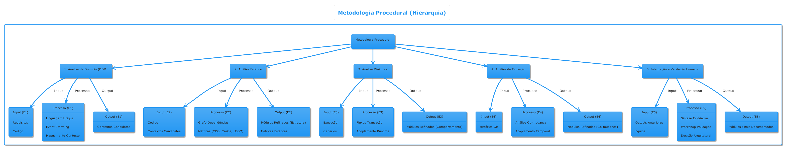
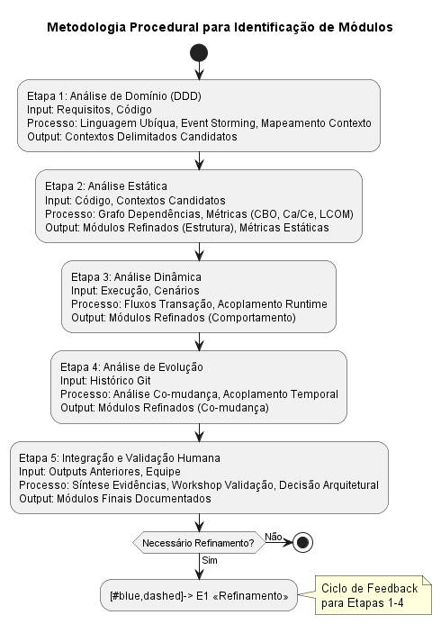

<!-- A identificação de módulos em um sistema monolítico exige analisar o sistema sob múltiplos critérios para encontrar divisões naturais e coesas. Segundo Abgaz et al. (2023) – em sua revisão sistemática sobre decomposição de monólitos – existem quatro abordagens principais de análise do monólito: análise de domínio, análise estática, análise dinâmica e análise de versões . Essas abordagens, frequentemente usadas para identificar microsserviços, também são aplicáveis à modularização interna de um monólito (o monólito modular) . A seguir, detalhamos cada método e os critérios utilizados, incluindo exemplos práticos e ferramentas de apoio quando apropriado.

### 3.1 Análise de Domínio e Contextos Delimitados (DDD)

A análise de domínio foca em entender a lógica de negócio e os limites naturais dentro do problema que o software resolve. Isso normalmente envolve identificar contextos delimitados (do Domain-Driven Design) – subdomínios ou áreas de negócio coesas que podem se tornar módulos. Abordagens de análise de domínio examinam artefatos de requisitos e design (modelos de casos de uso, diagramas de processos, diagramas ER, etc.) para descobrir “domínios de interesse”, ou seja, temas-chave ou elementos funcionais lógicos do sistema  . Em outras palavras, a partir da documentação e conhecimento do negócio, busca-se dividir o monólito conforme as capacidades de negócio (por exemplo, faturamento, gerenciamento de usuários, catálogo de produtos, etc.). Essas divisões correspondem aos contextos de negócio relativamente independentes. Técnicas do DDD, como event storming e mapeamento de contexto, ajudam os stakeholders a explicitar limites onde o vocabulário e as regras de negócio mudam, indicando módulos potenciais. Por exemplo, em um sistema de comércio eletrônico pode-se identificar contextos como Catálogo de Produtos, Carrinho/Pedidos, Pagamentos e Contas de Usuário, cada qual encapsulando um conjunto distinto de responsabilidades de negócio.

Para realizar essa identificação, é crucial envolver stakeholders (partes interessadas) e especialistas do domínio. Feedback de stakeholders – via workshops, entrevistas e revisão de documentos – é importante para validar se os possíveis módulos fazem sentido do ponto de vista do negócio e dos usuários. De fato, Abgaz et al. observam estudos em que documentação de processos e entrevistas com experts foram usadas junto com diagramas de contexto do domínio para definir os limites iniciais de módulos (contextos) . Esse alinhamento com o conhecimento tácito dos domain experts garante que os módulos identificados correspondam a responsabilidades claras e não quebrem regras de negócio importantes. Ferramentas como o Service Cutter suportam essa fase baseada em domínio: o Service Cutter, por exemplo, utiliza informações de alto nível (entidades de negócio, casos de uso, requisitos de domínio) para sugerir decomposição em serviços/modulos . Em suma, a análise de domínio (muitas vezes chamada model-driven ou domain-driven) identifica módulos candidatos ao redor de Bounded Contexts do domínio, garantindo coesão conceitual desde o início  .

### 3.2 Análise de Responsabilidades e Funcionalidades

Complementarmente à visão de domínio, analisa-se o monólito sob a ótica de suas responsabilidades e funcionalidades atuais. Aqui, o foco é determinar quais partes do código trabalham juntas para cumprir um determinado serviço ou caso de uso, seguindo o princípio de responsabilidade única. Um módulo adequado deve implementar um conjunto coeso de funcionalidades intimamente relacionadas – por exemplo, todas as funcionalidades relativas a pedidos devem estar no módulo Pedidos. Podemos começar listando as principais funcionalidades ou features do sistema e mapeando quais componentes (classes, funções, componentes UI, tabelas de banco etc.) estão associados a cada funcionalidade. Esse exercício evidencia agrupamentos naturais de elementos de software por responsabilidade.

A análise de responsabilidades muitas vezes revela sub-sistemas lógicos dentro do monólito – por exemplo, em uma aplicação de gestão hospitalar, pode-se ter subconjuntos de funcionalidades de agendamento, prontuário de pacientes, faturamento etc. que já são relativamente separados no código (mesmo que não formalmente modularizados). Critérios como o princípio da responsabilidade única e alto coesão funcional orientam a identificação: classes e funções que colaboram para a mesma tarefa de negócio devem idealmente residir no mesmo módulo. Na prática, pode-se documentar as funções principais do sistema e, a partir delas, inferir possíveis módulos. Essa abordagem utiliza tanto conhecimento de domínio quanto leitura do código para atribuir a cada parte uma responsabilidade primária. Por exemplo, ao revisar um módulo grande de “Processamento de Pedido”, pode-se subdividi-lo em responsabilidades menores: cálculo de frete, cálculo de impostos, autorização de pagamento, etc., e avaliar se essas responsabilidades formam partes coesas ou se algumas deveriam pertencer a módulos separados (como talvez um módulo de Pagamentos separado do módulo de Pedidos).

Vale notar que muitas técnicas de análise estática e de domínio também capturam responsabilidades. Por exemplo, a análise de casos de uso (DomA) identifica funcionalidades e as entidades envolvidas . Já a análise de coesão (discutida adiante) quantitativa pode confirmar se um conjunto de classes realmente apresenta uma única responsabilidade bem definida (alta coesão interna)  . Ferramentas de mapeamento de requisitos para módulos ou catálogos de funcionalidades (por exemplo, rastreabilidade de casos de uso para classes) podem auxiliar nessa etapa. Em essência, a identificação por responsabilidades assegura que cada módulo proposto tenha um propósito claro e delimitado, o que facilita comunicação com times e futuros testes.

### 3.3 Análise de Dependências Estáticas (Código)

A análise estática examina o código-fonte e suas dependências estruturais para encontrar possíveis divisões modulares. Trata-se de inspecionar chamadas de métodos, importações de classes/pacotes, dependências de bibliotecas e relacionamentos entre componentes no nível de código sem executar o sistema . O objetivo é identificar grupos de classes ou componentes que são fortemente conectados entre si (muitas dependências mútuas) mas fracamente conectados com o resto – esses grupos são candidatos a módulos, pois indicam alta coesão interna e baixo acoplamento externo. Por exemplo, se classes do pacote com.empresa.financeiro referenciam-se frequentemente, mas quase não referenciam classes de com.empresa.vendas, isso sugere que Financeiro e Vendas podem ser módulos separados.

Técnicas da literatura de microsserviços usam extensivamente essa análise estática. Muitas abordagens constroem um grafo de dependências ou de chamadas a partir do código e então aplicam algoritmos de clustering para encontrar comunidades de classes no grafo  . Abgaz et al. apontam que clustering não supervisionado é amplamente usado, incluindo métodos hierárquicos, k-means, propagação de afinidade, detecção de comunidades (Girvan-Newman), entre outros, para agrupar artefatos de software em serviços candidatos . Essencialmente, a matriz ou grafo de dependências serve como base: classes (ou funções/pacotes) são nós, e chamadas ou referências são arestas; algoritmos buscam partições que maximizem conexões intra-módulo e minimizem inter-módulo. Por exemplo, Gysel et al. (Service Cutter) utilizam um conjunto de critérios que incluem dependências de classes e relações de dados para sugerir cortes . Outra ferramenta, Arcan, analisa o código Java para detectar ciclos de dependência e possíveis módulos, sendo usada em pesquisas de extração de microsserviços .

Critérios específicos podem guiar a análise estática manualmente também: camadas do sistema (UI, domínio, persistência) devem preferencialmente não ser módulos separados por si, mas sim cada módulo deve conter suas camadas internas. Busca-se evitar acoplamentos entre possíveis módulos: por exemplo, muitas chamadas entre classes de “Pedidos” e “Inventário” indicam alto acoplamento – talvez esses componentes devam estar no mesmo módulo ou exigir refatorações para reduzir dependências. Dependências cíclicas são sinais de que as fronteiras não estão bem definidas; quebrar ciclos ou agrupá-los dentro de um mesmo módulo é uma tarefa importante. Ferramentas de análise estática (como jDepend, Structure101, SonarQube/Sonargraph ou plugins como ArchUnit para validar regras arquiteturais) ajudam a visualizar esses acoplamentos e a verificar se um particionamento proposto elimina dependências indesejadas entre módulos. Em pesquisas recentes, gráficos de chamada estáticos têm sido combinados com outros dados para melhorar a precisão dos cortes  , mas a análise estática pura já fornece uma base objetiva: o esqueleto estrutural do monólito.

### 3.4 Análise Dinâmica (Comportamento em Execução)

A análise dinâmica complementa a estática ao observar o sistema em execução, capturando como as partes do monólito interagem de fato em tempo de execução. Enquanto a análise estática considera todas as dependências teóricas no código, a dinâmica revela padrões reais de uso: quais componentes são invocados juntos em cenários reais, frequências de chamadas, sequências de transações, etc. Conforme Abgaz et al. definem, a análise dinâmica envolve examinar propriedades do programa durante sua execução, seja online (instrumentando o código ao rodar) ou coletando logs/traces para análise offline .

Na prática, realiza-se instrumentação (por exemplo, usando AOP ou ferramentas de monitoramento) para registrar traços de execução: chamadas entre classes, tempo de resposta, identificadores de threads, consultas de banco ocorridas, etc.  . Esses dados podem mostrar, por exemplo, que ao executar a função “Finalizar Pedido”, o sistema envolve módulos de Pedido, Pagamento e Notificação em sequência – indicando interações intermodulares necessárias. Se certas componentes quase nunca interagem em tempo real, talvez possam ser separados com segurança; por outro lado, componentes que trocam informação a todo momento podem justificar estarem no mesmo módulo (para evitar sobrecarga de comunicação). A análise de frequência de chamadas também destaca dependências críticas: Abgaz et al. mencionam sobrepor dados dinâmicos em grafos estáticos para ponderar arestas conforme frequência de execução . Assim, uma dependência que é raramente ativada pode ser tratada diferentemente de uma que ocorre em quase todas as transações – este insight ajuda a priorizar cortes que minimizem impacto em desempenho e consistência.

Ferramentas especializadas existem para captura dinâmica. Por exemplo, o Kieker é uma ferramenta que instrumenta aplicações Java para coletar dados de execução e foi empregada em estudos de extração de microsserviços . Monitoramento de logs de acesso ou uso de APMs (Application Performance Management) também fornece dados (p. ex., logs HTTP indicando quais módulos funcionais são invocados para cada endpoint). Em cenários de baixa observabilidade do monólito legado, pode-se habilitar logging detalhado ou temporariamente instrumentar funções-chave. Um caso interessante é usar logs de acesso ao banco de dados: se módulos distintos deveriam ter responsabilidade separada por tabelas distintas, mas os logs mostram um mesmo serviço acessando tabelas de domínios diferentes com frequência, isso indica limites mal desenhados. De fato, uma técnica mencionada em pesquisas é extrair dos logs quais tabelas são usadas por quais funcionalidades (ex.: usando DBeaver para monitorar consultas)  para ajudar a delinear módulos baseados em contexto de dados. Em suma, a análise dinâmica foca no comportamento real e fornece evidências baseadas no uso, evitando que modulagens se baseiem apenas em estrutura estática que talvez não reflita os fluxos de trabalho reais do sistema.

### 3.5 Análise da Evolução do Código (Histórico de Versões)

Outra perspectiva valiosa é a análise de versões do sistema, examinando o histórico de modificações no código (tipicamente via sistema de controle de versão, como Git). A ideia central é identificar quais partes do código evoluem juntas ao longo do tempo – se dois componentes são frequentemente alterados nos mesmos commits ou releases, isso sugere que têm uma forte relação funcional ou de dependência, podendo ser bons candidatos a ficar no mesmo módulo (para que evoluam em sincronia). Essa técnica revela o acoplamento evolutivo ou lógico que não é óbvio apenas pela estrutura de chamadas.

Abordagens nessa linha coletam dados de commits, diffs e histórico de mudanças para calcular, por exemplo, coeficientes de co-mudança: quantas vezes o arquivo A e B foram editados juntos . Uma alta co-mudança indica que funcionalidades implementadas nesses arquivos estão correlacionadas (talvez uma regra de negócio que exige mudanças coordenadas em múltiplas classes). Assim, para modularizar, é sensato agrupar os itens com alta co-evolução no mesmo módulo, reduzindo a necessidade de mudanças sincronizadas entre módulos distintos. Abgaz et al. relatam estudos onde gráficos estáticos de dependência foram enriquecidos com dados evolutivos – por exemplo, adicionando peso às arestas entre classes proporcionalmente à frequência de commits conjuntos . Esse processo torna o grafo mais representativo das dependências “vivas” no projeto, elevando conexões entre itens que historicamente andam juntos. Em outra abordagem, os dados de versão podem ser analisados separadamente para detectar componentes emergentes: clusters de arquivos que emergem dos padrões de commits.

Exemplo prático: imagine que no monólito de uma loja virtual, toda vez que a funcionalidade de promoção é alterada, também se modificam arquivos da funcionalidade de carrinho. Isso pode indicar que promoção e carrinho estão fortemente ligados (talvez indevidamente) – a análise de versão traria esse acoplamento lógico à tona, orientando o arquiteto a decidir se essas funcionalidades deveriam pertencer a um mesmo módulo ou, ao contrário, se é necessário refatorar para quebrar essa dependência implícita. Ferramentas caseiras podem ser desenvolvidas para extrair tais métricas de repositório (scripts que mineram o log do Git em busca de padrões de co-change). Academicamente, algumas ferramentas também incorporaram essa camada: por exemplo, o Microservice Miner e outros protótipos que integram informações de histórico no algoritmo de decomposição . A análise de evolução garante que a modularização planejada considere a dimensão temporal: módulos bons devem idealmente encapsular também ciclos de manutenção – um módulo deve poder ser mantido ou atualizado sem afetar muitos outros.

### 3.6 Integração das Análises e Abordagem Híbrida

Cada método acima oferece uma visão diferente do monólito, e na prática a identificação de módulos costuma combinar múltiplas perspectivas para aumentar a confiabilidade. Por exemplo, um processo recomendado é: (i) usar a análise de domínio (e stakeholders) para propor um esboço inicial de módulos (por fronteiras de negócio), (ii) aplicar análise estática para verificar dependências do código que suportam ou contradizem essas fronteiras (ajustando onde necessário para eliminar acoplamentos fortes entre módulos diferentes), (iii) utilizar dados dinâmicos para validar que cada módulo candidato consegue executar suas funções majoritariamente de forma independente (checando se não há chamada excessiva entre módulos em tempo de execução), e (iv) consultar o histórico de versões para confirmar que os arquivos dentro de cada módulo realmente têm alta coesão de mudança e poucas dependências de evolução com módulos externos. Essa abordagem iterativa foi exemplificada em estudos como [P16] (referenciado por Abgaz et al.): os autores primeiro definiram contextos de negócio por documentação e entrevistas, depois refinaram esses bounded contexts utilizando análise estática e dinâmica para ajustar fronteiras . Combinar análise manual (regras definidas por especialistas) com algoritmos de clustering é outra estratégia eficiente – regras baseadas em domínio podem guiar o algoritmo a produzir módulos alinhados com requisitos de alto nível  .

Além disso, é útil aplicar heurísticas conhecidas de design modular: por exemplo, agrupar classes que acessam os mesmos dados e separar classes que mudam por motivos diferentes (princípio de separação de motivos de mudança). Ferramentas de apoio permitem experimentar diferentes cortes. Algumas oferecem visualização dos módulos candidatos – e.g., a ferramenta ExploreViz mencionada por Abgaz et al. gera visualizações 3D dos serviços propostos com base em dados estáticos/dinâmicos , ajudando a equipe a inspecionar se os agrupamentos fazem sentido. Algoritmos genéticos também foram aplicados para otimizar a composição dos módulos de forma multi-objetivo, tentando maximizar coesão e minimizar acoplamento automaticamente  .

Importante destacar que, mesmo com análises automatizadas, a validação humana é imprescindível. Após identificar módulos candidatos com essas técnicas, deve-se revisá-los com arquitetos e desenvolvedores experientes no sistema para verificar se: (a) cada módulo tem um nome e propósito claro, (b) as fronteiras não quebram regras de negócio (por exemplo, um módulo não deveria precisar violar encapsulamento de outro para cumprir suas tarefas), e (c) se a modularização faz sentido para a estrutura da equipe e planos futuros (considerando, por exemplo, quais partes poderiam virar microsserviços independentes no futuro próximo). Esse ciclo de análise e revisão aumenta as chances de identificar módulos de qualidade.

[//]: # (Tabela 1 resume os principais métodos de identificação de módulos no monólito e seus enfoques:)

[//]: # (| Método de Identificação      | Enfoque e Critérios                                                                                                                                                                                                          | Referências e Exemplos                                                                                                                                                                                                                                                                                                        |)

[//]: # (|------------------------------|------------------------------------------------------------------------------------------------------------------------------------------------------------------------------------------------------------------------------|-------------------------------------------------------------------------------------------------------------------------------------------------------------------------------------------------------------------------------------------------------------------------------------------------------------------------------|)

[//]: # (| Análise de Domínio           | Delimitação por subdomínios de negócio &#40;Bounded Contexts&#41;; utiliza artefatos de requisitos &#40;modelos, casos de uso, processos&#41; para identificar temas funcionais.                                                       | DDD, Event Storming, mapas de contexto; Ex.: módulos Vendas, Estoque, Pagamentos. Abgaz et al.: identifica “domínios de interesse” via modelos de negócio.                                                                                                                         |)

[//]: # (| Análise de Responsabilidades | Delimitação por funcionalidades e responsabilidades do código; agrupa elementos por feature ou caso de uso, buscando responsabilidade única por módulo.                                                                 | Revisão de casos de uso e mapeamento para componentes de código; princípio SRP &#40;Single Responsibility Principle&#41; aplicado a módulos. Ex.: Usuários vs Relatórios.                                                                                                               |)

[//]: # (| Análise Estática &#40;Código&#41;     | Estudo de dependências estruturais no código &#40;chamadas, imports, acesso a dados&#41;; identificação de clusters com alta coesão interna e baixo acoplamento externo.                                                        | Grafos de chamadas, DSM &#40;matriz de estrutura&#41;; algoritmos de clustering &#40;hierárquico, k-means, comunidade&#41;. Ferramentas: jDepend, Arcan, Service Cutter.                                                                                                                         |)

[//]: # (| Análise Dinâmica &#40;Execução&#41;  | Observação de interações em tempo de execução; agrupa componentes que colaboram nos mesmos fluxos de uso e analisa frequência de interações.                                                                                  | Tracing/log de chamadas, profiling de módulos ativos por caso de uso. Ferramentas: Kieker &#40;instrumentação Java&#41;, logs de acesso e APM. Ex.: monitoração de chamada entre serviços internos durante operações críticas.                                                             |)

[//]: # (| Análise de Versões           | Mineração do histórico de código; detecção de arquivos que mudam juntos frequentemente &#40;acoplamento evolutivo&#41; e padrões de co-mudança indicando dependências lógicas.                                                 | Métricas de co-change, análise de commits Git. Ex.: scripts para contar commits comuns entre módulos; uso de heurísticas de evolução para pesar grafos estáticos. Ferramenta experimental: Microservice Miner integrando dados evolutivos.                                        |)

[//]: # (| Feedback de Stakeholders     | Consulta a desenvolvedores, arquitetos e usuários-chave para validar e refinar fronteiras; considera conhecimento não explícito no código &#40;ex.: prioridades de negócio, restrições organizacionais&#41;.                   | Workshops, entrevistas, brainstorming com domain experts. Ex.: equipe confirma que Faturamento deve ser separado de Pedidos por requisitos legais, mesmo que haja interdependência técnica &#40;justificando refatoração&#41;.                                                              |)

### Tabela 1: Principais Métodos de Identificação de Módulos no Monólito

| Método de Identificação      | Descrição                                                                                                                                                                                                          | Exemplos/Indicadores                                                                                                                                                                                                                                                                                                        |
| ---------------------------- | ------------------------------------------------------------------------------------------------------------------------------------------------------------------------------------------------------------------ | --------------------------------------------------------------------------------------------------------------------------------------------------------------------------------------------------------------------------------------------------------------------------------------------------------------------------- |
| **Análise de Domínio**       | Delimitação por subdomínios de negócio (*Bounded Contexts*); utiliza artefatos de requisitos (modelos, casos de uso, processos) para identificar temas funcionais.                                         | - Técnicas: DDD, Event Storming, mapeamento de contextos; - Ex.: módulos Vendas, Estoque, Pagamentos; - Abgaz et al.: identificação de “domínios de interesse” a partir dos modelos de negócio.                                                                                                                     |
| **Análise de Responsabilidades** | Delimitação por funcionalidades e responsabilidades do código; agrupa elementos por feature ou caso de uso, buscando a responsabilidade única de cada módulo.                                        | - Foco em revisão de casos de uso e mapeamento para componentes de código; - Princípio SRP (Single Responsibility Principle) aplicado aos módulos; - Ex.: separar módulo de Usuários do módulo de Relatórios.                                                                                                    |
| **Análise Estática (Código)**     | Estudo de dependências estruturais no código (chamadas, imports, acesso a dados); identificação de clusters com alta coesão interna e baixo acoplamento externo.                                     | - Uso de grafos de chamadas e DSM (matriz de estrutura); - Algoritmos de clustering (hierárquico, k-means, detecção de comunidades); - Ferramentas: jDepend, Arcan, Service Cutter.                                                                                                                              |
| **Análise Dinâmica (Execução)**  | Observação de interações em tempo de execução; agrupa componentes que colaboram nos mesmos fluxos de uso e analisa a frequência de interações.                                                       | - Utilização de tracing, logs e profiling para identificar fluxos de uso; - Ferramentas: Kieker (instrumentação Java), logs de acesso e APM; - Ex.: monitoramento de chamadas entre serviços internos durante operações críticas.                                                                          |
| **Análise de Versões**           | Mineração do histórico de código; detecta arquivos que mudam juntos frequentemente (acoplamento evolutivo) e padrões de co-mudança que indicam dependências lógicas.                              | - Uso de métricas de co-change e análise de commits Git; - Ex.: scripts para contar commits comuns entre módulos; - Ferramenta experimental: Microservice Miner que integra dados evolutivos para pesar grafos estáticos.                                                                                       |
| **Feedback de Stakeholders**     | Consulta a desenvolvedores, arquitetos e usuários-chave para validar e refinar fronteiras; considera conhecimentos não explícitos no código (prioridades de negócio, restrições organizacionais). | - Realização de workshops, entrevistas e sessões de brainstorming com domain experts; - Ex.: confirmação de que o módulo Faturamento deve ser separado do módulo Pedidos devido a exigências legais, mesmo com interdependência técnica.                                                                  |
Tabela 1: Métodos para identificação de módulos em um monólito e critérios utilizados.

Em resumo, identificar módulos em um monólito é um processo multidimensional. Métodos baseados em domínio garantem alinhamento com as fronteiras naturais do negócio; análises do código (estática e dinâmica) fornecem evidências técnicas de dependências e interações; a análise de versões revela laços históricos de manutenção; e o feedback humano assegura que os módulos farão sentido na prática. A literatura sobre migração para microsserviços oferece um arcabouço rico de técnicas que pode (e deve) ser aproveitado também na modularização interna de um monólito  – afinal, um monólito modular bem delineado muitas vezes difere de um conjunto de microsserviços apenas na forma de implantação e não nos princípios de separação por trás dos módulos. -->

A identificação de módulos coesos e fracamente acoplados é a pedra angular da transição bem-sucedida de um sistema monolítico para uma arquitetura de monólito modular. Em vez de apresentar um conjunto de técnicas isoladas, propomos aqui uma metodologia procedural integrada, onde cada etapa se baseia na anterior, refinando progressivamente a identificação dos limites modulares. Esta abordagem combina múltiplas perspectivas (negócio, código estático, comportamento dinâmico, evolução histórica e feedback humano) para aumentar a confiabilidade dos resultados, sempre correlacionando as escolhas metodológicas com o impacto esperado nas métricas de qualidade.

Visão Geral da Metodologia Procedural:

### Etapa 1: Análise de Domínio e Contextos Delimitados (DDD)

Objetivo Principal:
Identificar os limites lógicos fundamentais do negócio refletidos no sistema, visando maximizar a coesão conceitual (CHD - Conceptual Cohesion of Domain) e estabelecer uma base semântica sólida para os módulos.

#### Input:

1. Documentação de requisitos funcionais e não funcionais do Evently.
2. Entrevistas ou workshops com especialistas de domínio (se possível) e stakeholders.
3. Código-fonte existente (para análise exploratória inicial do domínio).
4. Modelos de dados existentes.

#### Processo:

1. Mapeamento de Linguagem Ubíqua: Identificar os termos e conceitos chave usados pelos especialistas de domínio para descrever as diferentes partes do Evently (ex: Evento, Inscrição, Participante, Pagamento, Notificação, Usuário, Permissão).

2. Identificação de Subdomínios:
   Agrupar funcionalidades relacionadas em subdomínios principais (Core Domain, Supporting Subdomains, Generic Subdomains). Por exemplo, no Evently, 'Gerenciamento de Eventos' e 'Processamento de Inscrições' podem ser Core, 'Autenticação/Autorização' pode ser Supporting/Generic, 'Notificações' pode ser Supporting.

3. Event Storming (Simplificado ou Completo): Mapear os eventos de negócio significativos (ex: EventoCriado, InscricaoRealizada, PagamentoConfirmado, NotificacaoEnviada) e identificar os comandos que os disparam e as políticas/regras associadas. Agrupar eventos e comandos relacionados pode revelar limites naturais.

4. Mapeamento de Contexto: Definir explicitamente os limites entre os subdomínios identificados, criando Contextos Delimitados (Bounded Contexts) candidatos. Cada contexto deve ter sua própria linguagem ubíqua e modelo conceitual. Por exemplo, o conceito de 'Usuário' pode ter atributos diferentes no contexto de 'Autenticação' vs. 'Inscrição'.

5. Documentação Inicial dos Contextos: Descrever brevemente a responsabilidade principal de cada Bounded Context candidato (ex: Contexto 'Gestão de Eventos' - responsável por criar, publicar, atualizar e consultar informações sobre eventos; Contexto 'Inscrições' - responsável por registrar participantes em eventos, gerenciar vagas; Contexto 'Pagamentos' - responsável por processar pagamentos de inscrições).

#### Output:

1. Lista documentada de Bounded Contexts candidatos a módulos.
2. Glossário de Linguagem Ubíqua por contexto.
3. Mapa de Contexto inicial (visual ou textual) mostrando as relações entre os contextos.

#### Conexão com a Próxima Etapa e Métricas:

A lista de Bounded Contexts serve como input fundamental para a Análise de Dependências Estáticas. A forte coesão conceitual buscada nesta etapa visa diretamente maximizar métricas como CHD e estabelecer uma base para minimizar o acoplamento funcional e semântico entre os futuros módulos.

### Etapa 2: Análise de Dependências Estáticas

1. Objetivo Principal: Refinar os limites dos módulos candidatos identificados na Etapa 1, analisando as relações estruturais no código-fonte. O foco é agrupar classes/componentes fortemente acoplados internamente e identificar pontos de acoplamento externo que precisam ser gerenciados ou minimizados. Visa-se aumentar a coesão estrutural (ex: LCOM4, SMQ) e reduzir o acoplamento estrutural (ex: CBO, Afferent/Efferent Coupling).

#### Input:

1. Código-fonte completo do projeto Evently (.NET 8 / C# 12).
2. Lista de Bounded Contexts candidatos da Etapa 1.
3. Ferramentas de análise estática (ex: NDepend, Visual Studio Code Analysis / Roslyn Analyzers, scripts customizados).

#### Processo:

1. Construção do Grafo de Dependências: Utilizar ferramentas para mapear as dependências entre classes, namespaces e projetos dentro da solução Evently. Visualizar este grafo pode revelar clusters naturais de componentes interconectados.

2. Análise de Acoplamento: Calcular métricas de acoplamento para classes e potenciais módulos:
   CBO (Coupling Between Objects): Contar o número de outras classes/tipos aos quais uma classe está acoplada (usa ou é usada por). Valores altos podem indicar que a classe está muito dispersa ou que o limite do módulo candidato está mal definido.

- Acoplamento Aferente (Ca): Número de classes externas que dependem de classes dentro do módulo candidato. Alto Ca pode indicar um módulo central/fundamental, mas também um potencial gargalo.
- Acoplamento Eferente (Ce): Número de classes externas das quais as classes dentro do módulo candidato dependem. Alto Ce indica alta dependência externa, o que prejudica a autonomia do módulo.
- Instabilidade (I = Ce / (Ca + Ce)): Métrica derivada que varia de 0 (máxima estabilidade) a 1 (máxima instabilidade). Módulos devem ter um equilíbrio apropriado (Princípio da Dependência Estável).

3. Análise de Coesão Estrutural: Calcular métricas de coesão:

- LCOM4 (Lack of Cohesion in Methods): Mede quantos "componentes conectados" existem dentro de uma classe com base no compartilhamento de variáveis de instância pelos métodos. Um valor > 1 indica que a classe pode ter mais de uma responsabilidade e talvez deva ser dividida. Ferramentas como NDepend calculam variações desta métrica.
- SMQ (Structural Modularity Quality - se ferramenta disponível): Métricas mais avançadas que consideram a estrutura interna do módulo como um todo.

4. Identificação de Ciclos de Dependência: Detectar ciclos de dependência entre namespaces ou projetos, pois eles forçam o acoplamento e dificultam a separação em módulos independentes. Devem ser quebrados através de inversão de dependência ou refatoração.

5. Refinamento dos Limites: Com base nas métricas e na visualização do grafo, ajustar os limites dos Bounded Contexts candidatos. Classes com alto acoplamento mútuo devem idealmente pertencer ao mesmo módulo. Dependências fortes entre módulos candidatos podem indicar a necessidade de redefinir limites ou introduzir interfaces explícitas.

#### Output:

1. Grafo de dependências refinado.
2. Relatório de métricas de acoplamento e coesão por classe/módulo candidato.
3. Lista de ciclos de dependência identificados e sugestões para quebrá-los.
4. Versão revisada da lista de módulos candidatos e seus componentes internos.

#### Conexão com a Próxima Etapa e Métricas: Os limites refinados estruturalmente e as métricas calculadas servem de input para a Análise Dinâmica. A análise estática foca em melhorar LCOM4, CBO, Ca/Ce e identificar violações estruturais, complementando a visão de negócio da Etapa 1.

### Etapa 3: Análise Dinâmica (Comportamental)

1. Objetivo Principal: Validar e refinar os limites modulares observando o comportamento real do sistema em execução, focando nos padrões de comunicação e fluxos de dados entre componentes. Busca identificar acoplamentos não óbvios estaticamente e avaliar a intensidade das interações, visando minimizar o acoplamento em tempo de execução e validar a coesão funcional.

#### Input:

1. Aplicação Evently instrumentada ou com logging/tracing detalhado habilitado.
2. Conjunto de cenários de uso representativos (casos de teste, simulação de carga).
3. Ferramentas de profiling, tracing distribuído (se aplicável, ex: OpenTelemetry com Jaeger/Zipkin) ou análise de logs (ex: Seq, ELK stack).
4. Lista de módulos candidatos refinada na Etapa 2.

#### Processo:

1. Execução de Cenários: Rodar a aplicação Evently sob os cenários de uso definidos, coletando dados de execução (chamadas de método, queries a banco, mensagens trocadas, tempos de resposta).

2. Análise de Fluxos de Transação: Mapear as sequências de interações entre os componentes (identificados como pertencentes aos módulos candidatos) para realizar operações de negócio chave (ex: fluxo de inscrição completa, desde a UI até a confirmação do pagamento e notificação).

3. Identificação de Acoplamento Oculto: Procurar por interações intensas ou inesperadas entre componentes que pertencem a módulos candidatos diferentes. Isso pode incluir:

- Chatty communication: Muitas chamadas de baixo nível entre módulos para completar uma única operação.

- Dependências de dados compartilhados: Acesso frequente e concorrente à mesma tabela de banco de dados por múltiplos módulos candidatos (pode indicar um limite mal definido ou a necessidade de uma API de dados).

- Transações distribuídas implícitas: Operações que requerem coordenação complexa ou rollbacks entre múltiplos módulos.

4. Análise de Frequência e Latência: Quantificar a frequência das chamadas entre módulos candidatos e a latência associada. Interações muito frequentes ou de alta latência podem indicar um ponto de acoplamento problemático.

5. Refinamento com Base no Comportamento: Ajustar os limites modulares com base nos padrões de comunicação observados. Componentes que colaboram muito intensamente em tempo de execução talvez devam pertencer ao mesmo módulo, mesmo que a análise estática sugerisse separação.

#### Output:

1. Mapas de interação ou sequência para fluxos de negócio chave.
2. Lista de pontos de acoplamento em tempo de execução identificados (chatty communication, dados compartilhados, etc.).
3. Dados quantitativos sobre frequência e latência de interações entre módulos candidatos.
4. Versão novamente revisada da lista de módulos candidatos.

#### Conexão com a Próxima Etapa e Métricas: Os insights sobre o comportamento real complementam a visão estática e servem de input para a Análise de Evolução. A análise dinâmica ajuda a validar a coesão funcional (componentes que trabalham juntos em runtime) e a identificar acoplamentos de desempenho ou comportamentais que métricas estáticas não capturam.

### Etapa 4: Análise da Evolução do Código (Histórico de Versões)

1. Objetivo Principal: Identificar módulos ou componentes que tendem a mudar juntos ao longo do tempo, sugerindo um acoplamento lógico ou funcional (coesão de mudança). Esta análise ajuda a descobrir dependências que não são óbvias nas análises estática ou dinâmica.

#### Input:

1. Histórico completo do repositório Git do projeto Evently.
2. Ferramentas de análise de histórico de versões (ex: scripts customizados usando git log, ferramentas como CodeScene ou similares que analisem co-mudança).
3. Lista de módulos candidatos refinada na Etapa 3.

#### Processo:

1. Análise de Co-mudança (Co-change): Analisar o histórico de commits para identificar arquivos ou classes que são frequentemente modificados juntos no mesmo commit. Pares ou grupos de arquivos com alta frequência de co-mudança são fortes candidatos a pertencerem ao mesmo módulo lógico.

2. Análise de Acoplamento Temporal: Investigar sequências de commits onde mudanças em um componente são frequentemente seguidas por mudanças em outro em commits subsequentes. Isso pode indicar uma dependência lógica ou um fluxo de trabalho comum.

3. Identificação de Hotspots de Mudança: Localizar arquivos ou componentes que sofrem modificações muito frequentes. Hotspots podem indicar áreas complexas ou instáveis, mas se um hotspot interage frequentemente com outros componentes específicos, isso pode informar os limites modulares.

4. Mapeamento com Módulos Candidatos: Cruzar os resultados da análise de co-mudança com a estrutura dos módulos candidatos. Se arquivos que mudam juntos estão espalhados por diferentes módulos candidatos, isso sugere que os limites podem precisar de ajuste para agrupar esses componentes logicamente acoplados.

#### Output:

1. Lista de grupos de arquivos/classes com alta frequência de co-mudança.

2. Identificação de padrões de acoplamento temporal.

3. Mapa de hotspots de mudança.

4. Sugestões de refinamento dos limites modulares com base na coesão de mudança.

#### Conexão com a Próxima Etapa e Métricas: Os insights sobre acoplamento lógico complementam as visões de negócio, estática e dinâmica, fornecendo mais uma evidência para o refinamento final dos limites. A coesão de mudança é uma métrica qualitativa/quantitativa importante que direciona esta etapa.

### Etapa 5: Integração das Análises, Validação Humana e Refinamento Iterativo

1. Objetivo Principal: Consolidar os resultados de todas as análises anteriores, aplicar o julgamento de especialistas (arquitetos, desenvolvedores seniores) para validar e refinar os limites modulares propostos, e estabelecer um processo iterativo.

#### Input:

1. Outputs de todas as etapas anteriores (Bounded Contexts, grafos de dependência, métricas estáticas/dinâmicas, análise de co-mudança).

2. Conhecimento e experiência da equipe de desenvolvimento e arquitetura do Evently.

#### Processo:

1. Síntese das Evidências: Compilar e comparar os resultados das análises de domínio, estática, dinâmica e de evolução. Identificar áreas de concordância (onde todas as análises apontam para o mesmo limite) e áreas de conflito (onde diferentes análises sugerem limites distintos).

2. Workshop de Validação: Apresentar as evidências e os limites modulares propostos à equipe. Discutir os pontos de conflito, considerar fatores não capturados pelas análises (ex: estratégia de negócio futura, conhecimento tácito da equipe, restrições tecnológicas específicas).

3. Tomada de Decisão Arquitetural: Com base na síntese das evidências e na discussão da equipe, tomar decisões informadas sobre os limites finais dos módulos. Documentar as justificativas para essas decisões, especialmente onde elas divergem das sugestões puramente técnicas.

4. Refinamento Iterativo: Reconhecer que a modularização não é um processo único. Planejar revisões periódicas dos limites modulares à medida que o sistema evolui, o domínio do negócio muda ou novas informações se tornam disponíveis. O feedback contínuo da equipe sobre a facilidade de trabalhar com os módulos (coesão percebida, acoplamento percebido) é crucial.

#### Output:

1. Definição final e documentada dos módulos do Monólito Modular Evently, incluindo seus componentes internos e interfaces expostas.

2. Justificativa das decisões arquiteturais tomadas.

3. Plano para monitoramento e refinamento contínuo da modularidade.

#### Conexão com a Próxima Etapa e Métricas:

Esta etapa conclui o processo de identificação. A definição final dos módulos serve como base para a avaliação detalhada da qualidade (Seção 4) e para o trabalho de refatoração subsequente. A validação humana garante que as métricas e análises técnicas sejam interpretadas no contexto correto.
